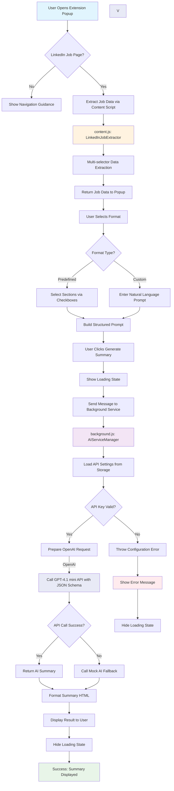

# Generate Summary Workflow Documentation

## Overview

This document explains the complete workflow that occurs when a user clicks the "Generate Summary" button in the LinkedIn Job Analyzer Chrome extension. The process involves multiple components working together to extract job data, generate AI-powered summaries using OpenAI's structured JSON output, and display results to the user.

## Components Involved

1. **Popup Interface** (`popup.html` + `popup.js`) - User interface and interaction handling
2. **Content Script** (`content.js`) - LinkedIn page data extraction
3. **Background Service** (`background.js`) - AI service integration and message routing
4. **Chrome Extension APIs** - Inter-component communication and storage

## Detailed Workflow

### Phase 1: User Interface Setup and Validation

1. **Extension Popup Opens** (`popup.js:55-59`)
   - Load language preferences from Chrome storage
   - Set up event listeners for user interactions
   - Update UI with localized text
   - Check if current tab is a LinkedIn job page

2. **LinkedIn Page Detection** (`popup.js:166-180`)
   - Validate URL pattern matches LinkedIn job posting format
   - Show appropriate guidance messages if not on correct page
   - Display success message if valid job page detected

3. **Job Data Pre-extraction** (`popup.js:223-247`)
   - Send message to content script to extract job data
   - Wait for response with job posting information
   - Validate extracted data quality
   - Store job data for summary generation

### Phase 2: User Format Selection

4. **Format Selection** (`popup.js:111-141`)
   - User chooses between "Predefined Format" or "Custom Format"
   - For predefined: User selects which sections to include via checkboxes
   - For custom: User enters natural language instructions
   - Button state updates based on valid selections

5. **Language Selection** (`popup.js:132-140`)
   - User can switch between English (EN) and Italian (IT)
   - Language preference saved to Chrome storage
   - UI text updates immediately with new language

### Phase 3: Summary Generation Trigger

6. **Generate Button Click** (`popup.js:123-125`)
   - Validates that job data is available
   - Shows loading state to user
   - Hides any previous error or info messages
   - Calls `generateSummary()` method

### Phase 4: Prompt Construction

7. **Prompt Building for JSON Output** (`popup.js:282-303`)
   - **Predefined Format** (`popup.js:305-342`):
     - Gets selected sections from checkboxes
     - Builds JSON schema request with only requested fields
     - Includes language-specific instructions for JSON response
     - Adds technical term preservation rules for Italian
   
   - **Custom Format** (`popup.js:397-408`):
     - Uses user's natural language input
     - Wraps with JSON schema requirements
     - Ensures structured output regardless of custom request

8. **Job Data Formatting** (`popup.js:410-425`)
   - Combines extracted job data into structured text
   - Includes: title, company, location, salary, description, benefits, requirements
   - Merges with constructed prompt for AI processing

### Phase 5: AI Service Communication

9. **Background Service Call** (`popup.js:426-436`)
   - Sends message to background script with action: 'generateSummary'
   - Includes complete prompt with job data
   - Waits for AI service response

10. **AI Service Processing** (`background.js:229-242`)
    - Receives message from popup
    - Calls `handleGenerateSummary()` function
    - Routes to appropriate AI service based on settings

### Phase 6: OpenAI Integration

11. **API Key Validation** (`background.js:31-71`)
    - Loads API key from Chrome storage
    - Validates OpenAI API key format (starts with 'sk-')
    - Ensures proper initialization before API calls

12. **OpenAI Structured Output** (`background.js:73-142`)
    - Uses GPT-4.1 mini model with `response_format: { "type": "json_object" }`
    - System prompt defines exact JSON schema for consistent output
    - Constructs API request with system/user messages
    - Handles rate limiting and error responses
    - Parses and validates returned JSON structure
    - Returns structured data object instead of raw text

### Phase 7: Error Handling and Fallbacks

14. **Error Management** (`background.js:262-277`)
    - If AI service fails, automatically falls back to mock response
    - Logs detailed error information for debugging
    - Ensures user always receives some form of response

15. **Mock JSON Response** (`background.js:211-224`)
    - Returns structured JSON object when API unavailable
    - Maintains exact same schema as real API responses
    - Ensures consistent behavior during testing/fallback scenarios

### Phase 8: Response Processing and Display

16. **Structured Summary Formatting** (`popup.js:451-491`)
    - Receives JSON object from background service
    - Uses `formatStructuredSummary()` for consistent field rendering
    - Maps selected sections to corresponding JSON fields
    - Applies visual styling with consistent formatting
    - Falls back to legacy text parsing if needed for compatibility

17. **Result Display** (`popup.js:451-457`)
    - Shows formatted summary in result container
    - Hides loading state
    - Displays success state to user

18. **Error Display** (`popup.js:294-302`)
    - If generation fails, shows localized error message
    - Provides guidance for troubleshooting
    - Maintains UI state for retry attempts

## Mermaid Workflow Diagram

## Technical Implementation Details

### Content Script Data Extraction

The `LinkedInJobExtractor` class (`content.js:1-248`) uses multiple selector strategies to robustly extract job information:

- **Multi-selector approach**: Falls back through different CSS selectors as LinkedIn updates their page structure
- **Language awareness**: Handles both English and Italian LinkedIn interfaces
- **Dynamic content handling**: Automatically clicks "Show More" buttons to expand truncated content
- **Data validation**: Ensures minimum quality thresholds for extracted information

### AI Service Integration

The `AIServiceManager` class (`background.js:1-226`) provides:

- **OpenAI integration**: Dedicated GPT-4.1 mini support with structured JSON output
- **JSON schema enforcement**: Guarantees consistent response structure
- **API key validation**: OpenAI format checking (sk-prefix)
- **Error resilience**: Automatic fallback to structured mock JSON responses
- **Comprehensive logging**: Detailed console output for debugging and monitoring

### User Interface Responsiveness

The `PopupController` class (`popup.js:1-514`) ensures:

- **Real-time validation**: Button states update as user makes selections
- **Localization support**: Dynamic language switching with immediate UI updates
- **Progressive enhancement**: Graceful degradation when APIs unavailable
- **Visual feedback**: Loading states, success indicators, and error messages

## Configuration Requirements

- **API Key**: Users must configure OpenAI API key in extension options
- **Permissions**: Extension requires `activeTab`, `storage`, and host permissions for LinkedIn
- **Browser Support**: Chrome extension manifest v3 compatible

## Error Scenarios and Handling

1. **Invalid LinkedIn Page**: Shows navigation guidance
2. **Data Extraction Failure**: Displays retry instructions
3. **Missing API Key**: Directs to options page for configuration
4. **API Service Unavailable**: Falls back to mock response
5. **Network Connectivity Issues**: Shows connection error messages
6. **Invalid API Key Format**: Provides format guidance for corrections

This workflow ensures reliable job analysis functionality while maintaining user experience across various failure scenarios.