# Generate Summary Workflow Documentation

## Overview

This document explains the complete workflow that occurs when a user clicks the "Generate Summary" button in the LinkedIn Job Analyzer Chrome extension. The process involves multiple components working together to extract job data, generate AI-powered summaries using OpenAI's structured outputs with dynamic schema generation, and display results to the user.

## Key Technical Features

- **Dynamic Schema Generation**: SchemaManager creates JSON schemas on-the-fly based on user input
- **Infinite Field Flexibility**: Support for 1 to unlimited custom fields
- **Multiple Input Formats**: Comma, newline, dash, and bullet delimiter support
- **OpenAI Structured Outputs**: 100% JSON reliability with `json_schema` + `strict: true`
- **Smart Field Mapping**: Converts user field names to camelCase and back for display

## Components Involved

1. **Popup Interface** (`popup.html` + `popup.js`) - User interface and interaction handling
2. **Content Script** (`content.js`) - LinkedIn page data extraction
3. **Background Service** (`background.js`) - AI service integration and message routing
4. **SchemaManager Class** (`background.js`) - Dynamic JSON schema generation and field processing
5. **Chrome Extension APIs** - Inter-component communication and storage

## Detailed Workflow

### Phase 1: User Interface Setup and Validation

1. **Extension Popup Opens** (`popup.js:55-59`)
   - Load language preferences from Chrome storage
   - Set up event listeners for user interactions
   - Update UI with localized text
   - Check if current tab is a LinkedIn job page

2. **LinkedIn Page Detection** (`popup.js:166-180`)
   - Validate URL pattern matches LinkedIn job posting format
   - Show appropriate guidance messages if not on correct page
   - Display success message if valid job page detected

3. **Job Data Pre-extraction** (`popup.js:223-247`)
   - Send message to content script to extract job data
   - Wait for response with job posting information
   - Validate extracted data quality
   - Store job data for summary generation

### Phase 2: User Format Selection

4. **Format Selection** (`popup.js:111-141`)
   - User chooses between "Predefined Format" or "Custom Format"
   - For predefined: User selects which sections to include via checkboxes
   - For custom: User enters natural language instructions
   - Button state updates based on valid selections

5. **Language Selection** (`popup.js:132-140`)
   - User can switch between English (EN) and Italian (IT)
   - Language preference saved to Chrome storage
   - UI text updates immediately with new language

### Phase 3: Summary Generation Trigger

6. **Generate Button Click** (`popup.js:123-125`)
   - Validates that job data is available
   - Shows loading state to user
   - Hides any previous error or info messages
   - Calls `generateSummary()` method

### Phase 4: Dynamic Schema Generation and Prompt Construction

7. **Schema Generation** (`background.js:SchemaManager`)
   - **Predefined Format**:
     - Uses fixed schema with 7 predefined fields (jobTitle, company, salary, location, benefits, requiredSkills, teamCulture)
     - Generates schema with only selected checkbox fields as required
     - Applies language-specific field descriptions
   
   - **Custom Format**:
     - Parses user input with `parseCustomPrompt()` method
     - Splits by multiple delimiters: `,`, `\n`, `-`, `•`, `·`, `*`
     - Converts field names to camelCase with `createFieldKey()` (e.g., "titolo lavoro" → `titoloLavoro`)
     - Generates dynamic JSON schema with user-requested fields
     - Ensures OpenAI compliance with `additionalProperties: false`

8. **Prompt Building** (`popup.js:282-303`)
   - Constructs full prompt with job data and user instructions
   - Passes custom prompt to SchemaManager for schema generation
   - Includes enhanced system prompts to prevent AI hallucination

9. **Job Data Formatting** (`popup.js:427-440`)
   - Combines extracted job data into structured text
   - Includes: title, company, location, salary, description, benefits, requirements
   - Merges with constructed prompt for AI processing

### Phase 5: AI Service Communication

10. **Background Service Call** (`popup.js:447-454`)
    - Sends message to background script with action: 'generateSummary'
    - Includes complete prompt, selected fields, language, format type, and custom prompt
    - Waits for AI service response

11. **AI Service Processing** (`background.js:348-359`)
    - Receives message from popup with all parameters
    - Calls `handleGenerateSummary()` function with format detection
    - Routes to OpenAI service with dynamic schema generation

### Phase 6: OpenAI Structured Outputs Integration

12. **API Key Validation** (`background.js:194-217`)
    - Loads API key from Chrome storage
    - Validates OpenAI API key format (starts with 'sk-')
    - Ensures proper initialization before API calls

13. **Dynamic Schema Application** (`background.js:220-233`)
    - Calls SchemaManager with format type and custom prompt
    - Generates appropriate JSON schema (predefined vs custom)
    - Creates enhanced system message based on format type
    - Prevents AI hallucination with explicit "extract only real data" instructions

14. **OpenAI Structured Output Call** (`background.js:235-266`)
    - Uses GPT-4.1 mini model with `response_format: { "type": "json_schema", "strict": true }`
    - Applies dynamically generated schema for 100% JSON compliance
    - Constructs API request with enhanced system/user messages
    - Handles rate limiting and error responses
    - Returns guaranteed valid JSON structure
    - No manual JSON parsing needed (structured outputs guarantee)

### Phase 7: Error Handling and Fallbacks

15. **Error Management** (`background.js:379-394`)
    - If AI service fails, automatically falls back to mock response
    - Logs detailed error information for debugging
    - Ensures user always receives some form of response
    - Maintains same format type handling for consistency

16. **Mock JSON Response** (`background.js:317-343`)
    - Returns structured JSON object when API unavailable
    - Maintains exact same schema structure as real API responses
    - Supports both predefined and custom format structures
    - Ensures consistent behavior during testing/fallback scenarios

### Phase 8: Response Processing and Display

17. **Format-Specific Display Logic** (`popup.js:475-491`)
    - Receives JSON object from background service
    - Routes to appropriate formatter based on selected format:
      - **Predefined Format**: Uses `formatStructuredSummary()` with predefined field mappings
      - **Custom Format**: Uses `formatCustomSummary()` with dynamic field mapping
    - Maps camelCase fields back to original user field names for display
    - Applies consistent visual styling with structured formatting
    - Falls back to legacy text parsing if needed for compatibility

18. **Custom Field Mapping** (`popup.js:495-547`)
    - Extracts original field names from user's custom prompt
    - Creates mapping from camelCase keys back to display names (e.g., `titoloLavoro` → "titolo lavoro")
    - Uses same parsing logic as SchemaManager for consistency
    - Handles multiple delimiter types and mixed formatting

19. **Result Display** (`popup.js:475-491`)
    - Shows formatted summary in result container with proper field labels
    - Hides loading state
    - Displays success state to user

20. **Error Display** (`popup.js:295-302`)
    - If generation fails, shows localized error message
    - Provides guidance for troubleshooting
    - Maintains UI state for retry attempts

## Mermaid Workflow Diagram

```mermaid
graph TD
    A[User Opens Extension Popup] --> B{LinkedIn Job Page?}
    B -->|No| C[Show Navigation Guidance]
    B -->|Yes| D[Extract Job Data via Content Script]
    
    D --> E[content.js: LinkedInJobExtractor]
    E --> F[Multi-selector Data Extraction]
    F --> G[Return Job Data to Popup]
    
    G --> H[User Selects Format]
    H --> I{Format Type?}
    
    I -->|Predefined| J[Select Sections via Checkboxes]
    I -->|Custom| K[Enter Natural Language Prompt with Flexible Fields]
    
    J --> L[Generate Fixed Schema with Selected Fields]
    K --> M[Parse Custom Prompt for Field Names]
    M --> N[Convert to camelCase Identifiers]
    N --> O[Generate Dynamic JSON Schema]
    
    L --> P[Build Structured Prompt]
    O --> P
    
    P --> Q[User Clicks Generate Summary]
    Q --> R[Show Loading State]
    R --> S[Send Message with Schema Info to Background Service]
    
    S --> T[background.js: AIServiceManager + SchemaManager]
    T --> U[Load API Settings from Storage]
    U --> V{API Key Valid?}
    
    V -->|No| W[Throw Configuration Error]
    V -->|Yes| X[Apply Dynamic Schema to OpenAI Request]
    
    X --> Y[Call GPT-4.1 mini API with Structured Outputs]
    
    Y --> Z{API Call Success?}
    
    Z -->|Yes| AA[Return Valid JSON with Custom Fields]
    Z -->|No| BB[Call Mock AI Fallback with Same Schema]
    
    AA --> CC[Map camelCase Fields Back to Display Names]
    BB --> CC
    
    CC --> DD[Format Summary HTML with Proper Labels]
    DD --> EE[Display Result to User]
    
    W --> FF[Show Error Message]
    FF --> GG[Hide Loading State]
    
    EE --> HH[Hide Loading State]
    HH --> II[Success: Summary Displayed]
    
    style A fill:#e1f5fe
    style II fill:#e8f5e8
    style FF fill:#ffebee
    style E fill:#fff3e0
    style T fill:#f3e5f5
    style M fill:#fff8e1
    style O fill:#f1f8e9
    style Y fill:#e8eaf6
```

## Technical Implementation Details

### Content Script Data Extraction

The `LinkedInJobExtractor` class (`content.js:1-248`) uses multiple selector strategies to robustly extract job information:

- **Multi-selector approach**: Falls back through different CSS selectors as LinkedIn updates their page structure
- **Language awareness**: Handles both English and Italian LinkedIn interfaces
- **Dynamic content handling**: Automatically clicks "Show More" buttons to expand truncated content
- **Data validation**: Ensures minimum quality thresholds for extracted information

### AI Service Integration

The `AIServiceManager` class (`background.js:165-396`) provides:

- **OpenAI Structured Outputs**: GPT-4.1 mini with `json_schema` + `strict: true` for 100% reliability
- **Dynamic Schema Integration**: Works with SchemaManager for real-time schema generation
- **Enhanced System Prompts**: Prevents AI hallucination with explicit data extraction instructions
- **API key validation**: OpenAI format checking (sk-prefix)
- **Error resilience**: Automatic fallback to structured mock JSON responses with same schema
- **Comprehensive logging**: Detailed console output for debugging and monitoring

### SchemaManager Architecture

The `SchemaManager` class (`background.js:1-164`) provides:

- **Dynamic Schema Generation**: Creates OpenAI-compliant JSON schemas from user input
- **Multi-delimiter Parsing**: Handles `,`, `\n`, `-`, `•`, `·`, `*` in user prompts
- **camelCase Conversion**: Transforms "titolo lavoro" → `titoloLavoro` for JSON field names
- **Schema Caching**: Performance optimization for repeated schema requests
- **Multilingual Descriptions**: Field descriptions in user's selected language
- **OpenAI Compliance**: Enforces `additionalProperties: false` requirement

### User Interface Responsiveness

The `PopupController` class (`popup.js:1-648`) ensures:

- **Real-time validation**: Button states update as user makes selections
- **Format-specific handling**: Routes to appropriate display logic for predefined vs custom formats
- **Dynamic field mapping**: Maps camelCase identifiers back to original user field names
- **Multi-delimiter support**: Parses user input with same logic as SchemaManager
- **Localization support**: Dynamic language switching with immediate UI updates
- **Progressive enhancement**: Graceful degradation when APIs unavailable
- **Visual feedback**: Loading states, success indicators, and error messages

## Configuration Requirements

- **API Key**: Users must configure OpenAI API key in extension options
- **Permissions**: Extension requires `activeTab`, `storage`, and host permissions for LinkedIn
- **Browser Support**: Chrome extension manifest v3 compatible
- **OpenAI Model**: Requires GPT-4.1 mini for structured outputs support
- **Token Limits**: Custom field schemas limited by OpenAI token constraints

## Error Scenarios and Handling

1. **Invalid LinkedIn Page**: Shows navigation guidance
2. **Data Extraction Failure**: Displays retry instructions
3. **Missing API Key**: Directs to options page for configuration
4. **API Service Unavailable**: Falls back to mock response with same schema structure
5. **Network Connectivity Issues**: Shows connection error messages
6. **Invalid API Key Format**: Provides format guidance for corrections
7. **Schema Generation Failures**: Fallback to single general field for malformed custom prompts
8. **OpenAI Structured Output Errors**: Automatic retry with adjusted parameters
9. **Custom Field Parsing Issues**: Graceful handling of special characters and unsupported formats

## Key Improvements Over Previous Version

### Reliability Improvements
- **100% JSON Validity**: Structured outputs eliminate JSON parsing errors
- **Dynamic Schema Compliance**: All responses conform to user-defined schemas
- **Enhanced Error Prevention**: System prompts prevent AI hallucination

### Flexibility Improvements  
- **Infinite Field Support**: No longer limited to fixed field count
- **Multi-format Input**: Support for various delimiter types and mixed formatting
- **Real-time Schema Generation**: Custom schemas created on-demand

### User Experience Improvements
- **Preserved Field Names**: User's original field names maintained in display
- **Intelligent Field Mapping**: Seamless conversion between display and JSON formats
- **Enhanced Multilingual**: Better technical term preservation and language-aware schemas

This workflow ensures reliable job analysis functionality with infinite flexibility while maintaining user experience across various scenarios.